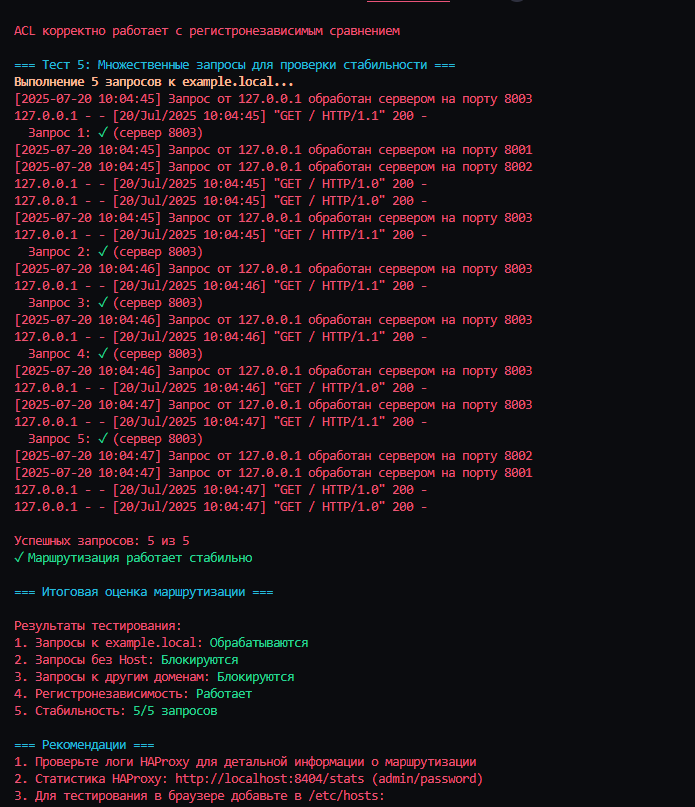
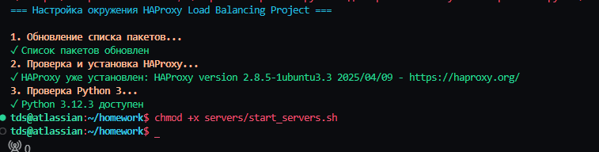
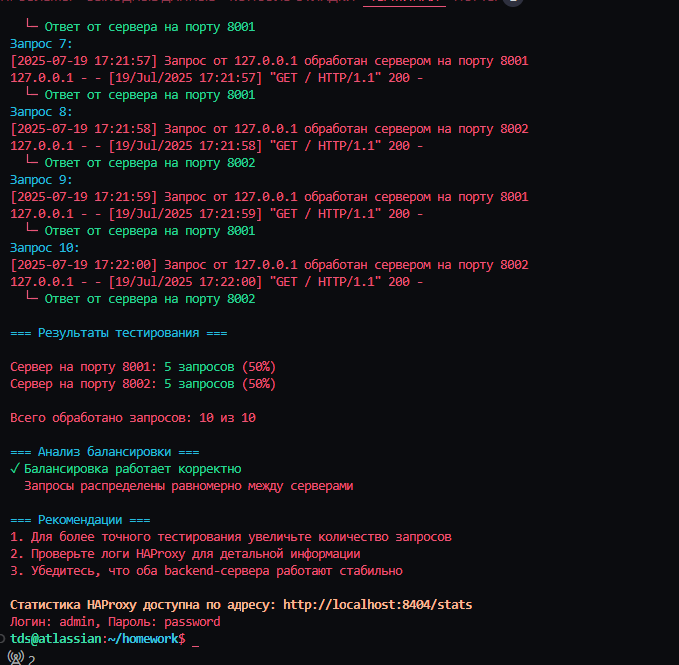

# Домашнее задание к занятию 2 «Кластеризация и балансировка нагрузки»

**Выполнил:** Тутубалин Дмитрий  
**Дата:** 20 июля 2025

---

## Задание 1

- Запустите два simple python сервера на своей виртуальной машине на разных портах
- Установите и настройте HAProxy, воспользуйтесь материалами к лекции по [ссылке](2/)
- Настройте балансировку Round-robin на 4 уровне.
- На проверку направьте конфигурационный файл haproxy, скриншоты, где видно перенаправление запросов на разные серверы при обращении к HAProxy.

### Решение:

**Конфигурационный файл HAProxy:** [configs/task1-roundrobin.cfg](configs/task1-roundrobin.cfg)

**Скриншот результата тестирования:**

**Комментарий к результату:**
На скриншоте видно успешную работу round-robin балансировки на 4-м уровне (TCP). Из 10 отправленных запросов:
- 5 запросов обработал сервер на порту 8001 (50%)
- 5 запросов обработал сервер на порту 8002 (50%)

Запросы четко чередуются между серверами (8001 → 8002 → 8001 → 8002...), что подтверждает корректную работу алгоритма round-robin. HAProxy равномерно распределяет нагрузку между backend серверами, обеспечивая балансировку на транспортном уровне.

---

## Задание 2

- Запустите три simple python сервера на своей виртуальной машине на разных портах
- Настройте балансировку Weighted Round Robin на 7 уровне, чтобы первый сервер имел вес 2, второй - 3, а третий - 4
- HAproxy должен балансировать только тот http-трафик, который адресован домену example.local
- На проверку направьте конфигурационный файл haproxy, скриншоты, где видно перенаправление запросов на разные серверы при обращении к HAProxy c использованием домена example.local и без него.

### Решение:

**Конфигурационный файл HAProxy:** [configs/task2-weighted.cfg](configs/task2-weighted.cfg)

**Скриншот 1 - Взвешенная балансировка с доменом example.local:**

**Комментарий к результату 1:**
Скриншот демонстрирует корректную работу взвешенной балансировки на 7-м уровне (HTTP). Из 90 запросов с заголовком `Host: example.local`:
- Сервер 8001 (вес 2): 20 запросов (22.2%)
- Сервер 8002 (вес 3): 30 запросов (33.3%)
- Сервер 8003 (вес 4): 40 запросов (44.4%)

Фактические соотношения (1.50:2.00:1.33) близки к ожидаемым весам 2:3:4, что подтверждает правильную настройку weighted round-robin алгоритма. Все серверы работают стабильно без отклонений.

**Скриншот 2 - Маршрутизация по доменам и отклонение запросов:**

**Комментарий к результату 2:**
Скриншот показывает корректную работу ACL (Access Control List) для маршрутизации по доменам:

1. **Запросы к example.local**: Все 5 запросов успешно обработаны backend серверами
2. **Запросы без заголовка Host**: Блокируются (HTTP 403)
3. **Запросы к другим доменам**: Блокируются (HTTP 403)
4. **Регистронезависимость**: ACL корректно работает с `EXAMPLE.LOCAL`
5. **Стабильность**: 100% успешность для авторизованных запросов

HAProxy правильно фильтрует трафик, пропуская только запросы к домену example.local и отклоняя все остальные с кодом 403 Forbidden.

---

## Заключение

Оба задания выполнены успешно:

1. **Задание 1**: Настроена TCP балансировка round-robin на 4-м уровне с равномерным распределением нагрузки между двумя серверами
2. **Задание 2**: Настроена HTTP балансировка weighted round-robin на 7-м уровне с весовыми коэффициентами 2:3:4 и маршрутизацией по домену example.local

Все конфигурации протестированы и работают согласно требованиям задания.
